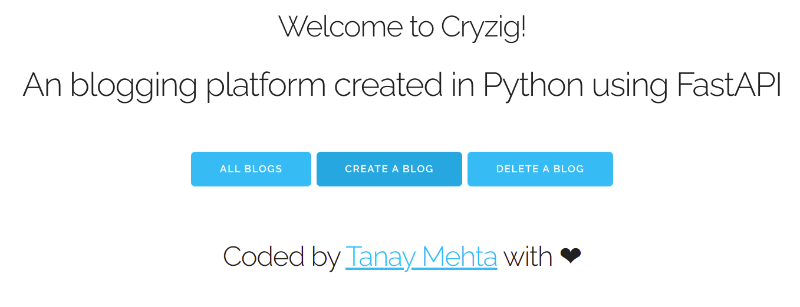

# Cryzig Blog

Welcome to Cryzig! It's a simple blogging platform that I'm making while learning FastAPI. It's written in Purely in Python 3.6 and it uses Barebones.css for front-end.

Just like every other thing in life, it is a work-in-progress. Currently, I have made it use Local Persistent Storage, which means that any blog that I make using this platform will be stored in form of `.json` file in the `data/` folder.

I am, although, thinking of changing this to mongodb in future, but it is what it is for now.

If you like my project, please star it!

Also, here's a Screenshot of how it looks for the time being, since I haven't deployed it yet (as it's not complete).

